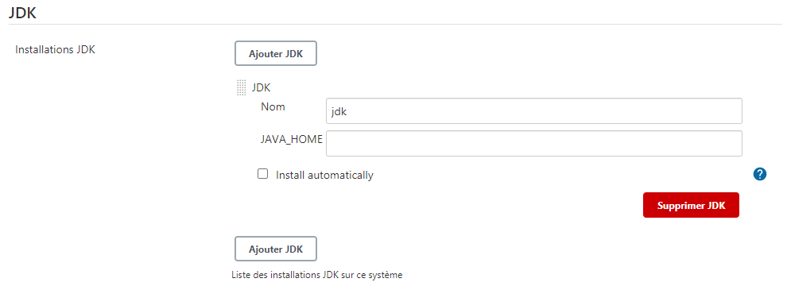
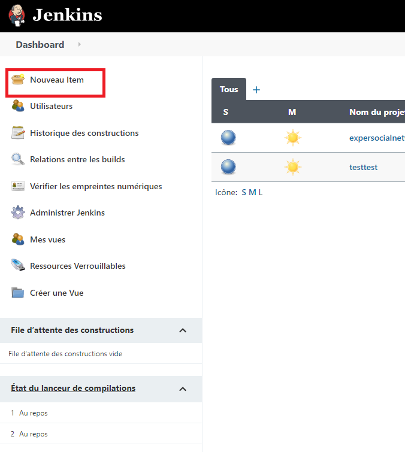
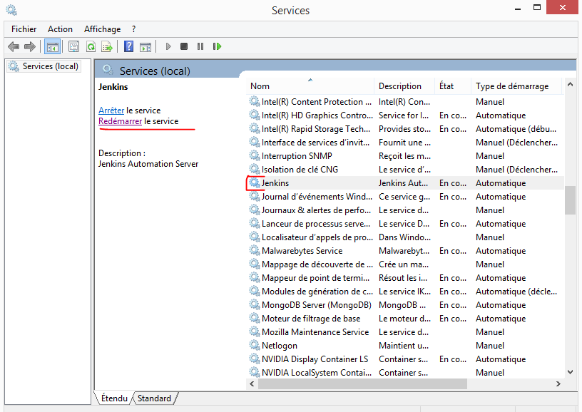

# Jenkins-CI/CD

Ce document a pour but d'expliquer ce qu'est Jenkins, comment l'installer ainsi que la notion de CI/CD

## CI/CD - Définition et avantages

CI/CD est un accronyme qui veut dire: Continuous Integration/Continuous Delivery/Deployement.

Le CI/CD représente une suite d'étape (pipeline) qui permet d'automatiser  le build, les tests et le deploiement d'une application dans un serveur.

Si on rentre un peu plus dans les détails, dans CI/CD, on distingue 3 notions distinctes:
#### CI(Continuous Integration):
C'est une suite d'étape qui va s'éxécuter après le push d'un code dans un repository. Généralement, un CI service se déclenchera après le push et exécutera un script dans un CI serveur.

Par exemple, imaginons qu'une équipe de 2 developpeurs veulent travailler sur un projet et qu'ils ont mis en place un systeme d'intégration continu. Lorsqu'ils vont push leur code sur un repository, un CI service(gitHub Action, Jenkins etc...) sera déclenché. Ce service entrainera une suite d'actions qui va lancer des commandes à partir du code qui été push. génréralement le code sera build et testé sur dans serveur pour voir si tout fonctionne correctement.

#### CD(Continuous Delivery):
C'est une extension de la Continuous Integration. Elle permet de rendre certains processus de deploiement automatique. Cette étape n'est pas à 100% automatique. L'homme peut encore intervenir dans un des étapes du déploiement.  

Si on reprend l'exemple ci-dessous, non seulement le code sera build et testé (CI) mais une fois que ces étapes sont passées, certains processus de déploiement seront aussi executés automatiquement. (CD) 


#### CD(Continuous Deployment): 

C'est le niveau au dessus du contiuous Delivery. Le continuous deployment rend le processsus de déploiement à 100% automatique. Aucunne intervention de l'homme n'est requise.

#### Le CI/CD apporte plusieurs avantages:

* Le developpeur n'a plus besoin de compiler, générer un executable, aller sur un serveur et installer une application. 
Tout est automatisé à travers un script. Le developpeur gagne du temps tout en évitant les erreurs humaines ou les oublis qu'il peut y avoir.
* Les bugs sont detectés plus rapidement et plus tôt car chaque push entraîne le deploiement et le test du code.
* Le developpeur a un feedback rapide du code qu'il a push.
* Les erreurs critiques dans un projet sont minimisées.
	


## Jenkins - à quoi ça sert ?

Jenkins est un outil open souce d'intégration continu (CI), qui a été developper en java. En utilisant Jenkins, on va créer une pipeline (une suite d'étape) à
travers des configurations qu'il faudra créer. Ces configurations sont appelés des Jobs.

jenkins a une grande force en ce moment: Sa communauté. Il existe plus de 1000 plugins qu'on peut installer et utiliser. Ce qui rend l'outil relativement complet.

## Jenkins - Installation (Windows)   
    
#### 1 - Téléchargement  

Allez sur la page officielle de Jenkins, dans la section téléchargement : https://www.jenkins.io/download/  
Sélectionnez la version LTS correspondant à votre système d'exploitation  (dans notre cas, Windows 10 x64).

#### 2 - Lancer l'installation  

Une fois le téléchargement terminé, lancez l'installeur et suivez les différentes étapes.
Lors de la 2e étape, pour une installation en local (tests), sélectionnez la première option (Run service as LocalSystem)

#### 3 - Lancer Jenkins  

Une fois l'installation terminée, Jenkins est installé sur votre machine en tant que service et démarre automatiquement en même temps que Windows. Ouvrez un navigateur et allez sur localhost, sur le port que vous avez configuré pendant l'installation (ex : http://localhost:8080).
Lors de la première installation de Jenkins, un mot de passe a été généré. La page vous indique le path où se trouve ce mot de passe. Ouvrez une commade windows et utilisez la commande TYPE + path-vers-mot-de-passe afin d'afficher celui-ci

```bash
type [path-to-password]
```

## Jenkins - Création d'un job (Windows, J2EE, Maven)   
    
#### 1 - Ajouter les plugins nécessaires

Allez dans "administrer Jenskins", puis dans "Gestion des plugnins"


Vérifiez que vous avez bien les plugins suivant installés : 
	
* Maven Integration plugin
* Git plugin


#### 2 - Vérifier l'installation de Maven
  
Allez dans "administrer Jenskins", puis dans "Configuration globale des outils"  

   

Ajoutez une installation de Maven, il y'a 2 méthodes possibles.
  
##### méthode 1:


Laissez la même configuration comme l'image ci-dessus. Appuyer sur "Appliquer" puis "Enregistrer"

##### méthode 2:


Décochez "Install autommatically" pour sélectionner une installation de Maven déjà présente sur votre poste. Appuyer sur "Appliquer" puis "Enregistrer"

#### 3 - Vérifier l'installation du JDK

Allez dans "administrer Jenskins", puis dans "Configuration globale des outils"  

   

Ajoutez une installation du JDK, il y'a 2 méthodes possibles.

##### méthode 1 (déconseillée):


Laissez la même configuration comme l'image ci-dessus. Appuyer sur "Appliquer" puis "Enregistrer".

ATTENTION: cette méthode demande d'ajouter des "credentials" (login et mot de passe) de votre compte java. Jenkins vous propose de les ajouter dans
le texte en jaune.(on ne la voit pas sur l'image ci-dessous)

##### méthode 2 (conseillée):



Décochez "Install autommatically" pour sélectionner une installation de Maven déjà présente sur votre poste. Appuyer sur "Appliquer" puis "Enregistrer"

	
	
	
#### 3 - Créer un job  

Ce premier job que nous allons réaliser consite à récupérer un projet depuis Git, générer le .war du projet et déplacer ce .war dans un dossier.

Cliquez sur "nouvel item"  



Saisissez un nom et séléctionnez "Construire un projet maven" puis cliquez sur "OK"  

  

Saisissez une description du projet, puis dans la partie "Gestion de code source" sélectionnez "Git"

Puis, depuis votre projet GitHub ou GitLab, copiez l'url de votre projet

  

Et collez là dans Repository URL

 

Si votre projet est en private, ajouter vos identifiants et mot de passe en cliquant sur "Ajouter" à côté de "crédentials"

Dans la partie "Build", nous allons utiliser les commandes Maven suivantes : clean war:war test.
Ces commandent permettent de supprimer les anciens fichiers générés, de générer le .war et d'executer les tests unitaires.
Indiquez également le nom de votre fichier POM à la racine (par défaut, pom.xml)

 

Dans la partie "Post Steps", nous allons déterminer les étapes que nous allons réalisé une fois que le build aura été fait. Dans notre cas, copier le .war vers un dossier.
Nous allons réaliser cette étape uniquement si le build s'est bien déroulé et que les tests sont passés, pour se faire, cochez la case "Run only if build succeeds"
Puis cliquez sur "Ajouter une étape post-build et sélectionner "Executer une ligne de commande batch Windows".
Puis utilisez les commandes suivantes : 

```batch
rmdir /q /s [dossier de destination]
mkdir [dossier de destination]
Xcopy /E /I C:\WINDOWS\system32\config\systemprofile\AppData\Local\Jenkins\.jenkins\workspace\testtest\target\ExperSocialNetwok2020.war [dossier de destination]

```

(NB : il se peut que le dossier où a été généré votre .war diffère de cet exemple. Si c'est le cas, nous verrons plus tard comment retrouver ce path et modifier cette configuration)

 

Cliquez ensuite sur "Apply" puis sur "Sauver"


Vous vous retrouvez sur la page de votre projet. Pour lancer votre premier build, cliquez sur le bouton "Lancer un build".
Dans la parrtie inférieure gauche de la page, vous retoruvez l'historique de vos build ainsi que le build que vous venez de lancer. Cliquez sur ce lien (voir image)


Vous vous retrouvez sur la page d'état de votre build, sur la droite vous pouvez voir la progression de celui-ci. Pour avoir plus de détails, cliquez sur "Console Output"


Sur cette page vous pourrez voir toutes les étapes par lesquelles passe Jenkins. Sur les images ci-dessous, vous verrez les étapes importantes du build (récupération du code source sur Github / GitLab, génération du .war, execution des test, appel de la commande bash pour copier le fichier).


(Dans la partie "génération du .war" (encadrée en rouge) vous voyez le path ou a été généré le .war. Si celui-ci diffère de l'exemple, vous pouvez modifier votre configuration de buil en cliquant sur le bouton "Configuration"


Vous pouvez maintenant vérifier dans votre dossier de destination si le .war a bien été placé.

## Troubleshooting - problèmes communs et solutions

#### mot de passe de connexion à Jenkins oublié 


Vous êtes sur cette page mais vous avez oublié votre mot de passe de connexion, et vous avez remarqué qu'il n'y a pas le petit texte "mot de passe oublié". Que faire dans ce cas ?
Il faut modifier le config.xml de jenkins.Voilà comment procéder:


1) Allez dans le chemin suivant: C:\Windows\System32\config\systemprofile\AppData\Local\Jenkins\.jenkins
   Vous y trouverez le config.xml. Ouvrez le avec un éditeur de texte.
 


2) Chercher la balise ci-dessus et mettez sa valeur à "false".



3) Allez dans le gestionnaire des services windows (tappez "service" dans la barre de recherche windows et vous devrez le trouver). Chercher le service "Jenkins".
Puis le redémarrer.


4) Allez sur votre navigateur. Rafraichissez la page. Rafraichissez la page où Jenkins est présent. Vous devriez pouvoir accéder à Jenkins sans demande d'authentification.

#### Erreurs lors du build 


Cette erreur indique que votre JDK n'est pas bien configuré. Le chemin du JDK que vous avez spécifié est invalide. (cf --> section Jenkins - Création d'un job (Windows, J2EE, Maven))


Cette erreur indique que vous avez utilisé la méthode avec l'installation automatique de JDK (cf cf --> section Jenkins - Création d'un job (Windows, J2EE, Maven)) avec des credentials invalides.


Cette erreur indique que Maven n'est pas bien configuré. Le chemin de Maven que vous avez spécifié est invalide. (cf --> section Jenkins - Création d'un job (Windows, J2EE, Maven))


## Comparatif avec les technologies similaires
Voici une liste non exhaustive des "concurrents" de Jenkins.

#### Bitbucket
* Prix : 3$/mois pas open source
* Plateforme : web
* Support : 
	* Support en ligne
* Fonctionnalités : 
	* Contrôle des sources
 	* Contrôles/Permissions d'accès
 	* Débogage
 	* Définition des priorités
 	* Déploiement continu
 	* Développement d'applications web
 	* Développement de logiciel
 	* Développement mobile
 	* Gestion des tests
 	* Livraison continue

#### Anypoint Platform
* Prix : Gratuit mais pas open source
* Plateforme : 
	* web 
	* windows
	* mac
* Support : 
	* Base de connaissances
	* FAQ
	* Forum
	* Support en ligne
	* Support téléphonique
	* Tutoriels vidéo
* Fonctionnalités : 
	* Contrôles d'accès / autorisations
	* Outils de collaboration
	* Test de compatibilité
	* La modélisation des données
	* Débogage
	* Gestion du déploiement
	* Développement mobile
	* Pas de code
	* Reporting / Analytics
	* Développement de logiciels
	* Contrôle de la source
	* Développement d'applications Web

#### GitLab
* Prix : 4$/mois
* Plateforme : web et iphone
* Support : 
	* Base de connaissances
	* FAQ
	* Forum
* Fonctionnalités : 
	* Meilleure intégration Docker
	* La mise à l'échelle des runners est simple
	* Exécution parallèle des travaux en phases
	* Risque de pipeline de graphe acyclique dirigé
	* Très évolutif grâce aux runners simultanés
	* Intégration des demandes de fusion
	* Ajout de tâches facile
	* Problèmes de conflit faciles à gérer
	* Bonnes politiques de sécurité et de confidentialité

#### Buddy
* Prix : compte gratuit mais mise à niveau possible environ 75$/mois
* Plateforme : Web
* Support : 
	* en ligne 
	* et téléphonique
* Fonctionnalités : 34

#### Bitrise
* Prix : 36$/mois open source
* Plateforme : 
	* WEB
	* windows
	* mac
	* Mobile
* Fonctionnalités : 
	* Livraison continue
	* Environnement hébergé
	* Flux de travail personnalisables
	* Créer un journal
 	* Gestion de la configuration
 	* Livraison continue
 	* Déploiement continu
 	* Débogage
 	* Gestion des autorisations
 	* Gestion de l'assurance qualité
 	* Gestion des tests

#### CircleCI
* Prix : 30$/mois pas open source
* Plateforme : 
	* Docker
	* Linux
	* macOS
	* Android
	* Windows
	* Runners auto-hébergés
* Support : 
	* Base de connaissances
	* FAQ
	* Forum
	* Support en ligne
	* Support téléphonique
	* Tutoriels vidéo
* Fonctionnalités / avantages : 
	* Flux de travail pour l'orchestration des tâches
	* Prise en charge de Docker de première classe
	* Choix du CPU / RAM
	* Prise en charge indépendante de la langue (C++, javascript, PHP, etc)
	* Mise en cache puissante
	* SSH ou exécutez des versions locales pour un débogage facile
	* Une sécurité inégalée
	* Tableau de bord Insights

#### TeamCity
* Prix : 
	* licence server pro gratuit
	* licence build agent 299$
* Plateforme : 
	* serveur Apache Tomcat
	* Windows
	* Linux
	* Ubuntu
	* Debian
	* RedHat
	* SUSE
* Support : 
	* Support en ligne
* Fonctionnalités :
	* Technologie avancée
	* Intégrations clés
	* Intégrations Cloud
	* Intégration continue
	* Configuration
	* Historique des builds
	* Infrastructure des builds
	* Suivi de la qualité du code
	* Interopérabilité VCS
	* Extensibilité et personnalisation
	* Maintenance système
	* Gestion des utilisateurs
	* Commit pré-testé

#### Travis CI
* Prix : une licence gratuite jusqu'à 249$/mois open source
* Plateforme : web
* Support : 
	* Base de connaissances
	* FAQ
	* Forum
	* Support en ligne
* Fonctionnalités : 
	* Survaillance des projets GitHub
	* Exécution des tests et génèration des résultats rapide. L'exécution de tests parallèles est possible.
	* Création des artefacts et vérification de la qualité du code
	* Déploiement facile sur les services cloud
	* Identification les changements de code petits et grands.
	* Les développeurs peuvent utiliser Travis CI pour regarder les tests lorsqu'ils sont en cours d'exécution.
	* L'outil s'intègre à Slack, HipChat, Email, etc.

#### Cyclr
* Prix : 599$/mois pas open source
* Plateforme : web
* Support : 
	* Base de connaissances
	* Support en ligne
	* Tutoriels vidéo 
* Fonctionnalités : 
	* Agrégation et publication de données
	* Analytique
	* Assemblage par glisser-déposer
	* Automatisation des processus métiers
	* Contrôle d'accès
	* Déploiement continu
	* Développement collaboratif
	* ETL (Extract Transform Load)
	* Gestion des tests
	* Livraison continue

#### Semaphone
* Prix : 20$/mois
* Plateforme : web
* Support : 
	* Base de connaissances
	* Support en ligne
* Fonctionnalités : 
	* Débogage
	* Déploiement continu
	* Gestion de la configuration
	* Gestion des autorisations
	* Gestion des tests
	* Journal de génération
	* Livraison continue

#### Codeship
* Prix : 49$/mois
* Plateforme : web
* Support : 
	* Support en ligne
* Fonctionnalités : 
	* Contrôle des sources
	* Contrôles/Permissions d'accès
	* Débogage
	* Déploiement continu
	* Développement de logiciel
	* Gestion de la configuration
	* Gestion des tests
	* Gestion du déploiement
	* Journal de génération
	* Livraison continue

#### Appcircle
* Prix : 49$/mois
* Plateforme : web et mobile
* Support : 
	* Support en ligne
* Fonctionnalités : 
	* Débogage
	* Déploiement continu
	* Gestion de la configuration
	* Gestion des autorisations
	* Gestion des tests
	* Journal de génération
	* Livraison continue

#### StarfishETL
* Prix : 200$/mois
* Plateforme : web et windows
* Support : 
	* Support en ligne
* Fonctionnalités : 
	* Accès mobile
	* Analyse de données
	* Analyse des performances
	* Compatible avec divers languages de programmation
	* Contrôle de qualité des données
	* Conversion de bases de données
	* Correspondance et fusion
	* Déploiement continu
	* Gestion des tests
	* Livraison continue

## Notre avis

Jenkins représente un réel gain de temps, surtout s'il s'agit d'une entreprise disposant d'un nombre conséquent d'applications.
Une fois la configuation mise en place, cette technologie permet aux équipe de développeurs de se concentrer sur leur expertise sans se soucier des contraintes de déploiement.

## Sources
